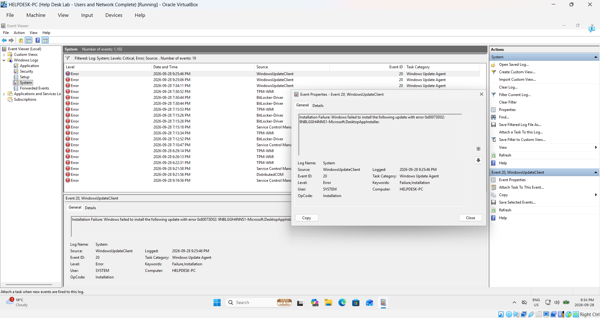
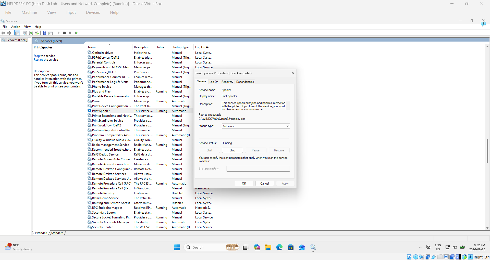
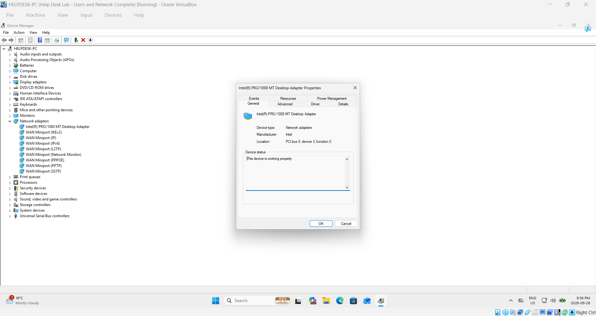
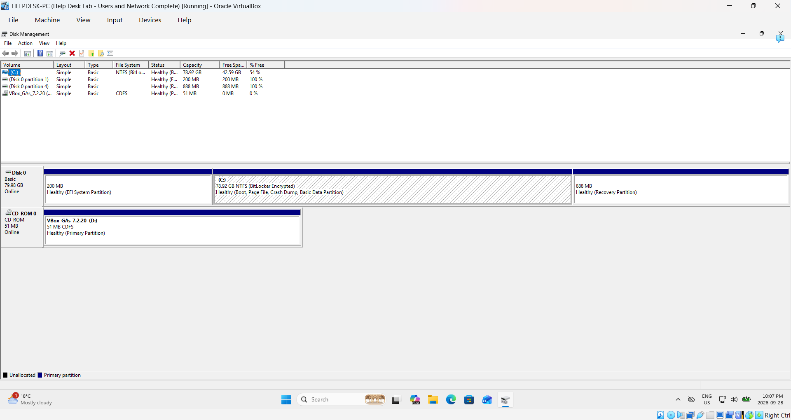
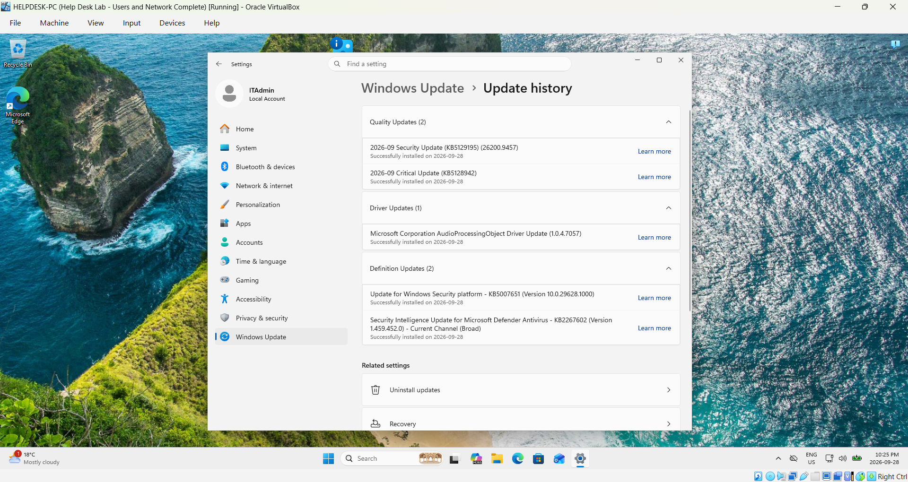
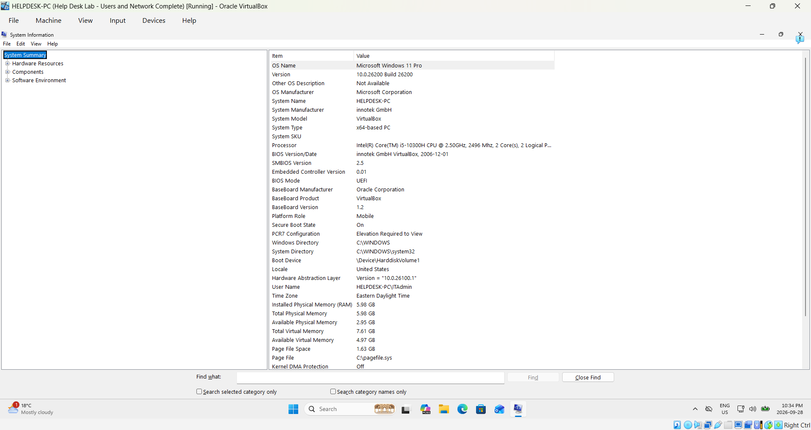
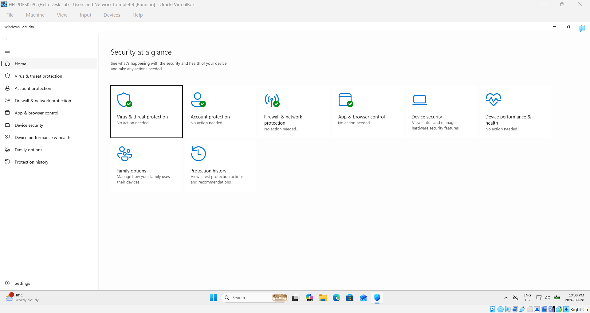

# Windows-11-Help-Desk-Home-Lab
A hands-on Windows 11 Help Desk home lab built with VirtualBox to practice Windows administration, user management, networking, troubleshooting, and common IT support tasks.

## Project Overview

This project is a hands-on Windows 11 Help Desk home lab created to practice common entry-level IT support, Windows administration, and troubleshooting tasks in a safe virtual environment.

Using Oracle VirtualBox, I created a Windows 11 Pro virtual machine named **HELPDESK-PC** to simulate a basic Help Desk environment. The lab allowed me to work with user accounts, networking, Windows administrative tools, system troubleshooting, security settings, and PowerShell without making potentially disruptive changes to my main computer.

The goal of this project was not only to complete the technical tasks, but also to understand why they are used in real IT support environments and develop a repeatable troubleshooting process.

## Skills Practiced

- Windows 11 installation and virtual machine configuration
- Local administrator and standard user account management
- Principle of least privilege and User Account Control (UAC)
- Windows networking and TCP/IP configuration
- Network troubleshooting using `ipconfig`, `ping`, and `nslookup`
- DNS testing and manual DNS configuration
- Windows Event Viewer log investigation
- Windows Services management and Print Spooler troubleshooting
- Device Manager hardware and driver inspection
- Disk Management and storage inspection
- Windows Update and Windows Security review
- System resource monitoring and system information
- Basic PowerShell administration and troubleshooting
- VirtualBox snapshots and virtual machine recovery

## Technologies & Tools

- Windows 11 Pro
- Oracle VirtualBox
- Windows PowerShell
- Command Prompt
- Computer Management
- Local Users and Groups
- Event Viewer
- Device Manager
- Disk Management
- Windows Services
- Windows Security
- Windows Update

## Lab Environment

- **Host Operating System:** Windows 11 Home
- **Virtualization Platform:** Oracle VirtualBox
- **Virtual Machine:** Windows 11 Pro
- **VM Name:** HELPDESK-PC
- **Memory:** Approximately 6 GB RAM
- **Virtual Disk:** 80 GB
- **Network Configuration:** VirtualBox NAT
- **Primary Administrator Account:** ITAdmin
- **Standard User Account:** Sarah Chen (`schen`)

## Project Documentation

This project includes detailed documentation of the lab build, configuration, testing, and troubleshooting process.

The documentation covers the Windows 11 virtual machine setup, user account configuration, networking tests, Windows administrative tools, security checks, PowerShell exercises, troubleshooting scenarios, and project verification.

A complete step-by-step build guide with screenshots will be included in this repository.

## Key Project Activities

1. Built and configured a Windows 11 Pro virtual machine using Oracle VirtualBox.
2. Installed VirtualBox Guest Additions and configured VM integration features.
3. Created separate administrator and standard-user accounts to practice user management and least privilege.
4. Examined the VM's network configuration and practiced TCP/IP and DNS troubleshooting using `ipconfig`, `ping`, and `nslookup`.
5. Investigated Windows logs using Event Viewer.
6. Practiced Windows service management and Print Spooler troubleshooting.
7. Inspected hardware and drivers using Device Manager.
8. Reviewed disks, partitions, and storage using Disk Management.
9. Reviewed Windows Update, Windows Security, system information, and resource usage.
10. Used PowerShell for basic Windows administration and troubleshooting.
11. Created and tested VirtualBox snapshots to practice VM recovery.

## Troubleshooting Approach

Throughout the lab, I practiced approaching technical problems systematically rather than immediately changing settings.

My general troubleshooting process was:

1. Identify the issue and gather information about the current system state.
2. Check the simplest and most likely causes first.
3. Use Windows administrative tools and command-line utilities to gather evidence.
4. Work from the local system outward when troubleshooting network connectivity.
5. Make one controlled change at a time when possible.
6. Test whether the change resolved the issue.
7. Verify that the system returned to the expected working state.
8. Document the issue, actions taken, and result.

This approach helped me focus on understanding the cause of a problem rather than only finding a temporary fix.

## What I Learned

This project strengthened my understanding of how common Windows Help Desk tasks connect together in a real troubleshooting process.

Some of my main takeaways were:

- Standard user accounts and administrator accounts should be separated so users only receive the permissions they need.
- Network troubleshooting is easier when approached systematically, starting with the local configuration and working outward toward the gateway, external connectivity, and DNS.
- Tools such as Event Viewer, Services, Device Manager, and Disk Management provide different types of evidence when diagnosing Windows issues.
- Commands such as `ipconfig`, `ping`, and `nslookup` can help isolate where a network problem is occurring.
- Windows Update and Windows Security are important parts of maintaining a healthy and secure endpoint.
- PowerShell provides another way to inspect and administer Windows systems beyond the graphical interface.
- Virtual machine snapshots provide a useful recovery point when testing configuration changes in a lab environment.

Most importantly, I learned that effective troubleshooting is not about memorizing individual fixes. It is about gathering information, narrowing down possible causes, making controlled changes, and verifying the result.

## Project Walkthrough

### 1. VirtualBox Lab Environment

I created a Windows 11 Pro virtual machine named **HELPDESK-PC** in Oracle VirtualBox to provide an isolated environment for practicing Help Desk administration and troubleshooting. The VM was configured with approximately 6 GB of RAM, an 80 GB virtual disk, and a NAT network adapter.

### 2. Local User Account Management

I created separate administrator and standard-user accounts to practice user management and the principle of least privilege. The **ITAdmin** account was used for administrative tasks, while **Sarah Chen (schen)** was configured as a standard user for everyday use.

Separating these account types helped demonstrate why users should only receive the permissions necessary for their role, reducing the risk of unauthorized or accidental system changes.

### 3. Network Configuration & TCP/IP

I used `ipconfig` to examine the TCP/IP configuration of the **HELPDESK-PC** virtual machine. The command displayed the VM's IPv4 address, subnet mask, and default gateway, which are important starting points when troubleshooting network connectivity.

The VM received the IPv4 address **10.0.2.15** with a subnet mask of **255.255.255.0** and used **10.0.2.2** as its default gateway. Because the VM was configured with VirtualBox NAT, VirtualBox provided the virtual network that allowed the VM to communicate outside its local environment.

Reviewing these values helped me understand how to begin troubleshooting from the local system outward by first checking the computer's network configuration before testing the gateway, external connectivity, and DNS.

### 4. Connectivity Testing

After reviewing the VM's TCP/IP configuration, I tested network connectivity in stages using `ping`.

I first pinged the default gateway at **10.0.2.2** to verify that the HELPDESK-PC virtual machine could communicate with the VirtualBox NAT gateway. The test returned four successful replies with **0% packet loss**, confirming that the VM could reach its gateway.

I then pinged **8.8.8.8** to test connectivity beyond the local virtual network. This test also returned four successful replies with **0% packet loss**, confirming that the VM had external network connectivity.

Testing connectivity in this order helped demonstrate a systematic troubleshooting approach: verify the local network configuration first, test the gateway next, and then test connectivity to an external IP address.

### 5. DNS Name Resolution

After confirming that the VM could reach an external IP address, I tested DNS name resolution using `nslookup google.com`.

The lookup successfully returned multiple IP addresses for **google.com**, confirming that the VM could communicate with a DNS server and translate a domain name into IP addresses.

This test helped demonstrate an important distinction in network troubleshooting. A computer may have working network connectivity but still be unable to access websites by name if DNS is not functioning correctly. By testing external IP connectivity first and DNS resolution afterward, I could isolate whether a connectivity problem was related to the network itself or to name resolution.

### 6. Manual DNS Configuration

To practice making a controlled network configuration change, I manually configured the HELPDESK-PC virtual machine to use Google's public DNS servers.

I set the preferred DNS server to **8.8.8.8** and the alternate DNS server to **8.8.4.4** while leaving the VM's IP address configuration assigned automatically through DHCP.

I then used `ipconfig /all` to verify the configuration. The output confirmed that the VM was using **8.8.8.8** and **8.8.4.4** as its DNS servers while retaining its existing IPv4 address and default gateway.

This exercise helped me understand that DNS settings can be changed independently of the computer's IP address configuration and reinforced the importance of verifying a configuration change after applying it.

### 7. Windows Event Viewer Troubleshooting

I used Windows Event Viewer to practice identifying and investigating system errors that could help diagnose a user or system issue.

In the **System** log, I filtered the events to focus on errors and identified a **WindowsUpdateClient** event with **Event ID 20**. The event showed that Windows had failed to install an update and provided the error code **0x80073D02**.

Rather than treating the presence of an error as the diagnosis itself, I reviewed the event source, Event ID, severity, timestamp, and message to gather information about what had occurred. This demonstrated how Event Viewer can provide useful evidence when investigating Windows problems.

This exercise reinforced the importance of using system logs as part of a structured troubleshooting process: identify the reported problem, review relevant events, gather specific error information, and use that evidence to determine the appropriate next troubleshooting steps.

### 8. Windows Services & Print Spooler Troubleshooting

I used the Windows Services console to practice troubleshooting a common Windows service issue using the **Print Spooler** service.

I first reviewed the Print Spooler and confirmed that its service name was **Spooler**, its startup type was set to **Automatic**, and the service was running. I then intentionally stopped the service to simulate a situation where printing functionality could be affected.

After observing the stopped state, I restarted the Print Spooler and verified that its status returned to **Running**. This demonstrated how restarting a Windows service can be used as a controlled troubleshooting step when investigating problems associated with that service.

This exercise helped me understand that service troubleshooting involves more than simply restarting a service. It is important to identify the correct service, review its current status and startup configuration, make a controlled change, and verify that the service returns to the expected state.

### 9. Device Manager & Hardware Status

I used Windows Device Manager to inspect hardware recognized by the HELPDESK-PC virtual machine and practice checking the status of a device during troubleshooting.

I expanded **Network adapters** and opened the properties of the **Intel(R) PRO/1000 MT Desktop Adapter**, which was the network adapter presented to the Windows VM by VirtualBox.

On the General tab, Windows reported **"This device is working properly."** This indicated that Windows recognized the adapter and was not reporting a device-level problem at the time of inspection.

Checking Device Manager provided another troubleshooting layer alongside the network tests I performed earlier. If a computer is experiencing a connectivity problem, verifying that the network adapter is recognized and checking its reported status can help determine whether further investigation should focus on the device or elsewhere in the network configuration.

## 10. Disk Management & Storage

I used Windows Disk Management to inspect the storage configuration of the HELPDESK-PC virtual machine and practice reviewing disk and partition information that can be useful during troubleshooting.

Disk Management showed **Disk 0** as a **79.98 GB Basic disk** with a status of **Online**. The main **C:** volume was formatted as **NTFS**, had a capacity of approximately **78.92 GB**, and was reported as **Healthy**. I also reviewed the EFI System Partition and Recovery Partition that support the Windows installation.

The C: volume had approximately **42.59 GB of free space**, or **54%** of its total capacity. The volume was also identified as **BitLocker Encrypted**. I observed these details without modifying, formatting, or deleting any partitions.

This exercise demonstrated how Disk Management can be used to verify that storage is recognized by Windows, review disk and volume health, inspect partition layout, and check available capacity before deciding whether additional troubleshooting is necessary.

## 11. Windows Update & Update History

I used Windows Update to review the update history of the HELPDESK-PC virtual machine and practice checking whether Windows updates had been installed successfully.

The Update History page provided a record of updates installed on the system, including quality updates, driver updates, and other Windows components. Reviewing this information can help determine whether a recent update was installed and provide useful context when troubleshooting system problems.

This also connected with my earlier Event Viewer investigation, where I identified a WindowsUpdateClient error related to a failed update installation. Using both Windows Update history and Event Viewer demonstrated how information from multiple Windows tools can be used together when investigating an update-related issue.

This exercise helped me understand the importance of reviewing update status and history as part of Windows maintenance and troubleshooting rather than assuming that all updates have installed successfully.

## 12. System Information Overview

I used Windows System Information to review the hardware and operating system details of the HELPDESK-PC virtual machine. This provided a centralized view of important system information that could be useful when documenting a computer or beginning a troubleshooting process.

The System Summary displayed information such as the computer name, Windows version and build, system manufacturer and model, processor, installed memory, BIOS information, and system type. Because this environment was running as a virtual machine, some of the hardware information also reflected the VirtualBox environment.

Reviewing System Information demonstrated how a help desk technician can quickly gather important details about a Windows computer before troubleshooting or making configuration changes. Having accurate system information can also help when documenting an issue or determining whether hardware, operating system, or software requirements are relevant.

## 13. Windows Security Overview

I used Windows Security to review the security status of the HELPDESK-PC virtual machine and become familiar with the built-in security areas available in Windows 11.

The **Security at a glance** page showed the status of several protection areas, including **Virus & threat protection, Account protection, Firewall & network protection, App & browser control,** and **Device performance & health**. At the time of the review, these areas displayed **No action needed**.

Reviewing Windows Security demonstrated how a help desk technician can quickly check the overall security status of a Windows computer and identify areas that may require attention. This can be a useful starting point when investigating security warnings, firewall issues, antivirus concerns, or general system-health problems.

